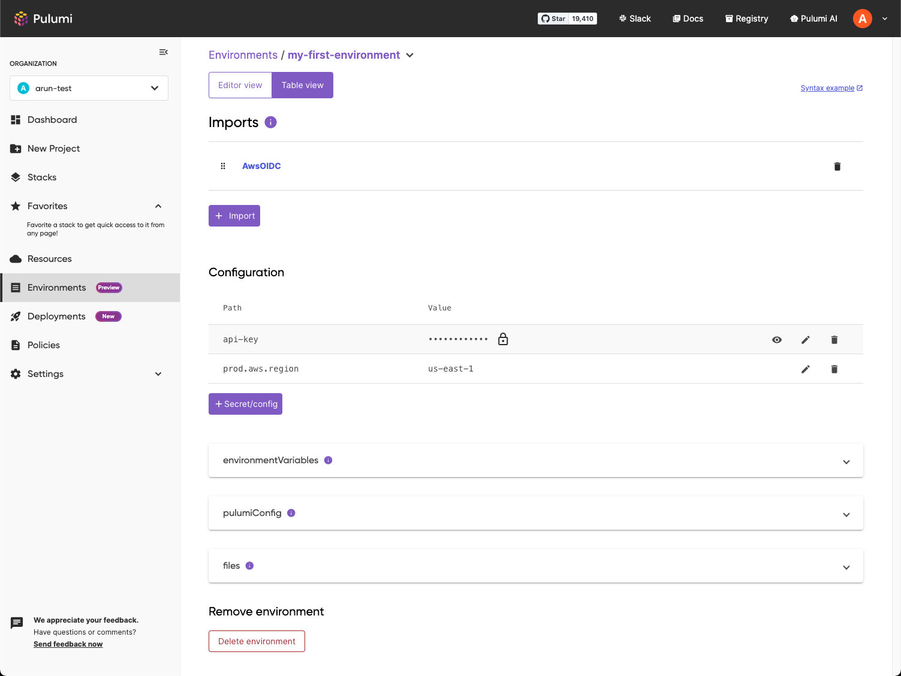

We're excited to announce the launch of the Key-Value Table Editor within Pulumi Environments, Secrets, and Configurations ([ESC](/product/esc)). At Pulumi, we're committed to providing flexible solutions that cater to diverse development needs and practices. This latest addition underscores our dedication to this principle by offering another user-friendly interface for managing complex configurations and secrets.

<!--more-->

The Key-Value Table Editor simplifies configuration tasks, allowing for direct input of plaintext and secret values. Key capabilities of the Table Editor include:

- **CRUD Operations**: Perform Create, Read, Update, and Delete (CRUD) operations on your secrets and  plaintext values
- **Decrypting Secrets**: Safely decrypt secrets one at a time, directly within the editor
- **Environment Imports**: [Import environments](/docs/esc/environments/#importing-other-environments) and define the order of imports to suit your project's needs
- **Variables Projections**: Make variables available as [Pulumi Config](/docs/esc/environments/#using-environments-with-pulumi-iac), [environment variables](/docs/esc/environments/#projecting-environment-variables), and files, streamlining your deployment and runtime configuration.
- **Interpolations and References**: Add references to existing path-values, or add [interpolations](/docs/esc/environments/#interpolating-values) to dynamically generate values

In the current release of the Table view, [provider configurations](/docs/esc/providers) and functions are set to read-only.  

## What’s Next?

Looking to the future, we are already planning the next set of enhancements for the Key-Value Table Editor. Soon, you'll be able to add and edit provider configurations directly within the table view, offering a more guided experience in utilizing Pulumi ESC's rich providers.

## Conclusion

The launch of the Key-Value Table Editor marks an important step in our mission to make infrastructure as code more accessible and manageable for developers.

Your [feedback](https://github.com/pulumi/esc/issues/new/choose) is the cornerstone of our development process. As we look ahead, we're focusing on incorporating your insights to further enhance the Key-Value Table Editor. Together, we can continue to refine and advance Pulumi ESC, making it an even more powerful tool for the developer community.

Check out our [documentation](/docs/esc) to learn more about Pulumi ESC.
